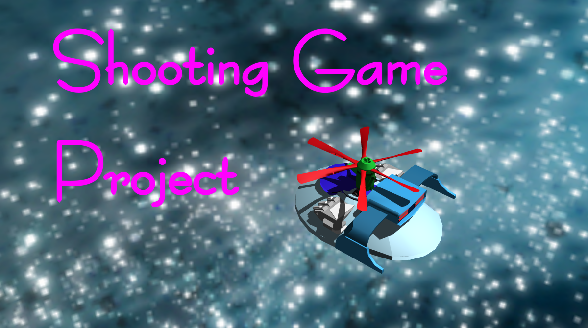

#Astro Direction 360 deg (仮称)

あまりにもかっこ悪いので仮称とします。

## ShootingGameつくる！

ShootingGame をつくる！作ってる間に様々なプログラミング技術をつけたい！！

## 構想

PC向け。全方位STGってやつ？ TM-Shooter を参考に、それでも違う感じにしていきたい!

## ゲームエンジン

phina.js を使わせてもらってます。

##画像素材

以下の画像ファイルはshioleapとProjectTeam DoGA様の共同著作物となります。 非営利目的での再利用が可能です。詳細は以下のURLを参照ください。

http://doga.jp/2010/programs/dogal/dogal3/license.html

- assets/fighters.png

以下の画像ファイルは @daishi_hmr 様の著作物となります。MITライセンスのもとで再利用可能だそうです。

- assets/tex0.png

##フォント素材

fontディレクトリ内のフォントファイルの利用条件については、以下のtxtファイルを参照ください。

- font/AdventPro-Medium.ttf
- font/OFL.txt
